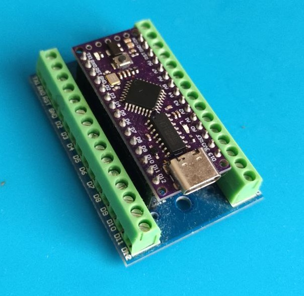

# OLTA-LAB-Generator

 

Зачастую требуется генератор прямоугольных импульсов. Для дома накидал программку в FLProg для lgt8f328p, пользуюсь шильдом для Arduino Nano. Прикупил усилитель для него. Будет время, дополню этот репозиторий более подробным описанием.
